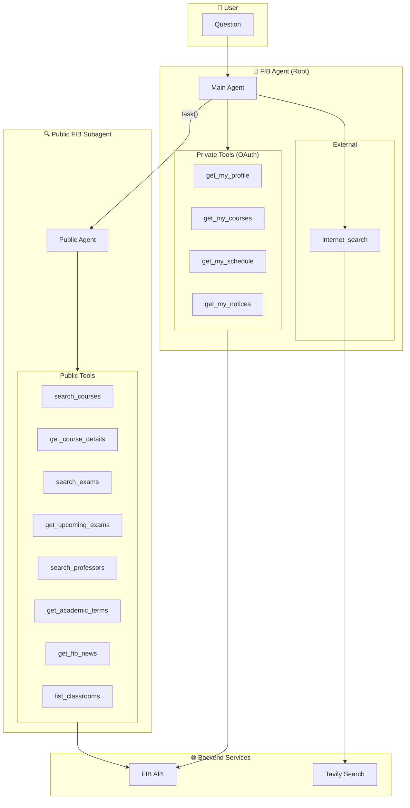
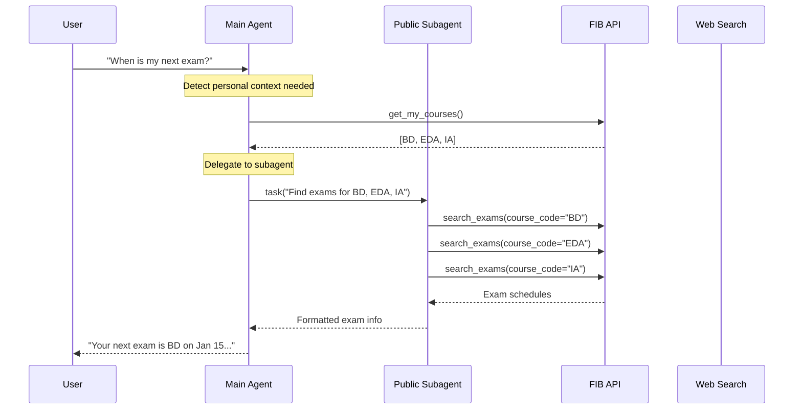
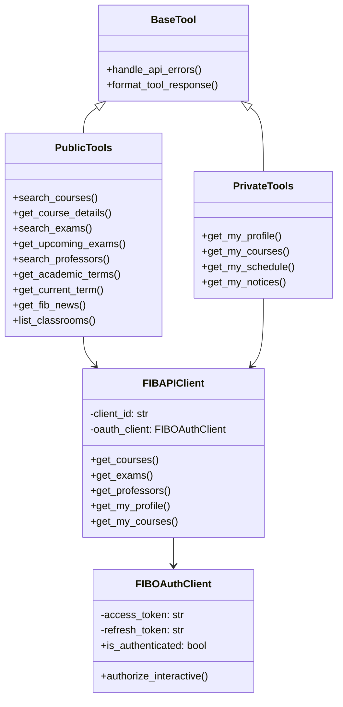
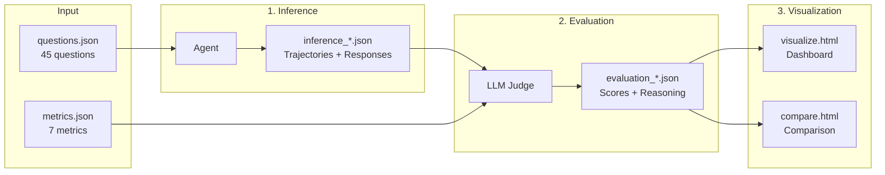

# UPC FIB Agent

A conversational AI agent for **FIB (Facultat d'Informàtica de Barcelona)** at UPC. It helps students, faculty, and staff with information about courses, exams, professors, schedules, and university news.

## Current Status

The agent is fully functional with:
- Hierarchical agent architecture using `deepagents`
- Public FIB API integration (courses, exams, professors, news, classrooms)
- Private API access via OAuth (user profile, enrolled courses, schedule, notices)
- MCP server for integration with compatible clients
- Comprehensive evaluation framework with visualization dashboards

### Supported Models

| Model | Status | Notes |
|-------|--------|-------|
| `gemini-2.5-flash` | ✅ Default | Fast, cost-effective |
| `gemini-2.5-flash-lite` | ✅ Supported | Lighter variant |
| `gemini-2.5-pro` | ✅ Supported | Higher quality |
| Custom `BaseChatModel` | ✅ Supported | Ollama, OpenAI, Anthropic, etc. |

## Architecture Overview



### Agent Flow



## Project Structure

```
upc-fib-agent/
├── src/
│   ├── agent/           # Agent implementation
│   │   └── main.py      # Hierarchical agent with subagent architecture
│   ├── api/             # FIB API client
│   │   └── client.py    # HTTP client with pagination & error handling
│   ├── auth/            # OAuth authentication
│   │   └── oauth.py     # OAuth2 authorization code flow
│   ├── mcp/             # MCP server
│   │   └── server.py    # Exposes FIB tools via Model Context Protocol
│   ├── models/          # Type definitions
│   │   └── fib_types.py # Pydantic models for API responses
│   └── tools/           # Agent tools
│       ├── courses.py   # Course search & details
│       ├── exams.py     # Exam schedules
│       ├── professors.py# Faculty search
│       ├── private.py   # User-specific tools (OAuth required)
│       └── ...          # Academic, news, classrooms
├── scripts/             # Utility scripts
│   ├── run_eval_inference.py  # Run agent on evaluation questions
│   └── run_eval_metrics.py    # LLM-as-judge evaluation
├── evaluation/          # Evaluation framework
│   ├── dataset/         # 45 test questions
│   ├── results/         # Inference & evaluation outputs
│   ├── visualize.html   # Interactive results dashboard
│   └── compare.html     # Multi-evaluation comparison
├── langgraph.json       # LangGraph Studio configuration
├── pyproject.toml       # Project configuration
└── README.md
```

## Component Details

### Tools Architecture



### Data Models

The agent uses strongly-typed Pydantic models for all FIB API responses:

| Model | Description | Key Fields |
|-------|-------------|------------|
| `Course` | Course/assignatura info | id, name, credits, semesters, study_plans |
| `Exam` | Exam schedule entry | course, datetime, room, type (Final/Partial) |
| `Professor` | Faculty member | name, email, courses_taught, department |
| `Classroom` | Room info | id, building |
| `AcademicTerm` | Semester info | id, is_current |
| `NewsItem` | FIB announcement | title, description, date |
| `UserProfile` | Authenticated user | name, email, study_plans |
| `UserCourse` | Enrolled course | course, grade, group |
| `UserClass` | Schedule entry | course, day, time, room |
| `UserNotice` | Course notice | title, content, attachments |

## Prerequisites

- Python 3.13 or higher
- `uv` package manager
- GCP account (for Vertex AI/Gemini access)

## Getting Started

### 1. Install Dependencies

```bash
uv sync --dev
```

### 2. Set Up Pre-commit Hooks

```bash
# Install pre-commit if needed
uv add pre-commit

# Install hooks
uv run pre-commit install
```

This ensures code quality checks run automatically on each commit.

### 3. Configure Environment Variables

```bash
cp .env.example .env
```

Fill in the required values:

| Variable | Description | How to Obtain |
|----------|-------------|---------------|
| `LANGSMITH_API_KEY` | LangSmith tracing | [LangSmith](https://langchain-5e9cc07a.mintlify.app/langsmith/home) |
| `TAVILY_API_KEY` | Web search (testing) | [Tavily](https://docs.tavily.com/documentation/quickstart) |
| `FIB_CLIENT_ID` | FIB API access | [FIB API Portal](https://api.fib.upc.edu/v2/o/applications/register_private/) |
| `FIB_CLIENT_SECRET` | OAuth authentication | Same as above |

### 4. Set Up GCP Authentication

```bash
# Install Google Cloud CLI
# https://cloud.google.com/sdk/docs/install

# Authenticate
gcloud auth login

# Set project (request access to alta-mente or create your own)
gcloud config set project alta-mente

# Set application default credentials
gcloud auth application-default login
```

### 5. Run LangGraph Studio

```bash
source .venv/bin/activate
langgraph dev --allow-blocking
```

This opens a browser window with LangSmith. Use the Studio in the sidebar to test the agent.

### 6. OAuth Authentication (Optional)

For accessing private endpoints (user profile, schedule, notices):

```bash
uv run python scripts/authenticate.py
```

This opens a browser for FIB login and stores the token locally.

## Evaluation

The evaluation framework tests agent performance using an **LLM-as-judge** approach.

### Quick Start

```bash
# Run inference on all 45 questions
make inference MODEL=gemini-2.5-flash

# Evaluate the results
make evaluate INPUT=evaluation/results/inference_gemini-2.5-flash_<timestamp>.json

# View results dashboard
cd evaluation && python -m http.server 8000
# Open: http://localhost:8000/visualize.html
```

### Evaluation Pipeline



### Evaluation Metrics

| Metric | Description |
|--------|-------------|
| **Relevance** | Does the response address the user's question? |
| **Helpfulness** | Is the response actionable and useful? |
| **Conciseness** | Appropriately brief without losing information? |
| **Structure** | Well-organized with appropriate formatting? |
| **Tone** | Professional and appropriate? |
| **Error Handling** | Graceful handling of missing data or failures? |
| **Tool Appropriateness** | Did it select and use the right tools? |

### Question Categories

| Category | Count | Description |
|----------|-------|-------------|
| `courses` | 11 | Course information queries |
| `exams` | 5 | Exam schedules and rooms |
| `professors` | 4 | Faculty information |
| `news` | 3 | FIB announcements |
| `academic` | 2 | Terms and semesters |
| `classrooms` | 2 | Room information |
| `personal` | 4 | User-specific (requires auth) |
| `multi_tool` | 5 | Complex multi-aspect queries |
| `ambiguous` | 4 | Vague queries needing clarification |
| `web_search` | 3 | External info queries |

## MCP Server

The agent tools are also available as an MCP server for integration with MCP-compatible clients:

```bash
# Run MCP server
uv run python -m src.mcp
```

Available tools: `search_courses`, `get_course_details`, `search_exams`, `get_upcoming_exams`, `search_professors`, `get_academic_terms`, `get_current_term`, `get_fib_news`, `list_classrooms`

## Development

### Code Style

This project uses:
- **Ruff** for linting and formatting
- **Pre-commit** hooks for automated checks
- **Absolute imports** only (no relative imports)
- **Module-level docstrings** only (no method docstrings)

### Running Tests

```bash
uv run pytest
```

### Common Commands

```bash
# Format code
uv run ruff format

# Lint
uv run ruff check --fix

# Run inference (evaluation)
make inference MODEL=gemini-2.5-flash LIMIT=5

# Run with custom model
make inference MODEL=ollama/llama3.2
```

## Useful Links

- [FIB API Documentation](https://api.fib.upc.edu/v2/)
- [LangGraph Documentation](https://langchain-ai.github.io/langgraph/)
- [deepagents Library](https://github.com/langchain-ai/deepagents)
- [MCP Protocol](https://modelcontextprotocol.io/)

## License

MIT License
